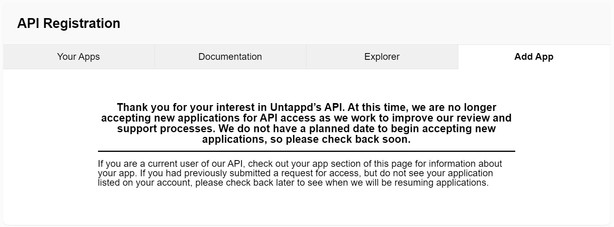

<p align="center">

</p>

# Untappdscr V.1.0.0 🍻
Is an [Untappd](https://untappd.com) scrapper made primarly for the public in collaboration with a private brewery company.


## Installation
```terminal
pip3 install untappdscr --upgrade
```

## Usage
Look into the `examples` folder, especially the `example_3.py` one.
```python
from untappdscr import UntappdScrapper
untappd = UntappdScrapper((1,2), True) # delay-range, debug-mode
print(untappd.get_top_rated_breweries())
```

## Brief Documentation
* **UntappdScrapper**()
* * **get_beer_picker_list**(*self, htmldoc=None*)
* * **get_brewery_picker_list**(*self, htmldoc=None*)
* * **get_picker_lists**(*self*)
* * **get_top_rated_breweries**(*self, country='', type='', picker=False*)
* * **get_top_rated_beers**(*self, country='', style='', picker=False*)
* * **get_beer**(*self, _id:int, activity_pages=1*)
* * **get_brewery**(*self, breweryname:str, activity_pages=1*)
* * **get_venue**(*self, _id:int, activity_pages=1, stats=True*)


## Why though?
Because [Untappd](https://untappd.com) stoped accepting new applications a long time ago.
<p align="center">

</p>


## Research
* ***Things I might need:***
* * https://github.com/borisbabic/browser_cookie3
* ***Projects:***
* * ***Inspired by:***
* * * https://github.com/WebBreacher/untappdScraper
* * * https://github.com/BrandonE/untappd-scraper-web
* * ***Other:***
* * * https://github.com/OrganicIrradiation/ratebeer