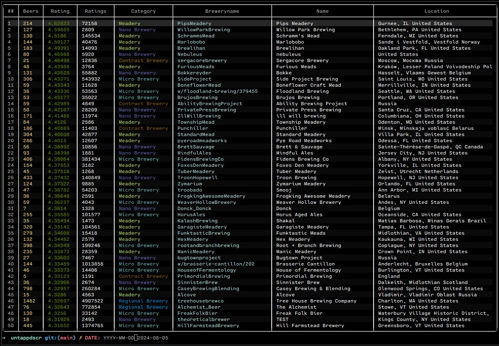
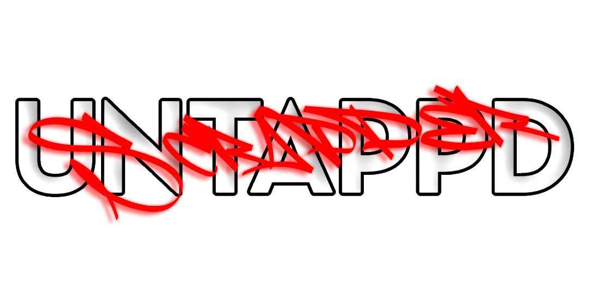

<p align="center">


</p>

# UNTAPPDSCR V.1.1.0 🍻
Is an [Untappd](https://untappd.com) scraper made primarly for the public in collaboration with a private brewery company.


## Installation
```terminal
pip3 install untappdscr --upgrade
```

## Usage
Look into the `examples` folder, especially `example_5.py`.
```python
from untappdscr import UntappdScraper
untappd = UntappdScraper((1,2), debug_mode=True) # delay-range, debug-mode
print(untappd.get_top_rated_beers())
```

## Brief Documentation
* **UntappdScraper**()
* * **get_beer_picker_list**(*self, htmldoc=None*)
* * **get_brewery_picker_list**(*self, htmldoc=None*)
* * **get_picker_lists**(*self*)
* * **get_top_rated_breweries**(*self, country='', type='', picker=False*)
* * **get_top_rated_beers**(*self, country='', style='', picker=False*)
* * **get_beer**(*self, _id:int, activity_pages=1*)
* * **get_brewery**(*self, breweryname:str, activity_pages=1*)
* * **get_venue**(*self, _id:int, activity_pages=1, stats=True*)


## Why though?
Because [Untappd stoped](https://untappd.com/api/register) accepting new applications a long time ago.

<picture>
  <source media="(prefers-color-scheme: dark)" srcset="https://raw.githubusercontent.com/GiorgosXou/untappdscr/main/imgs/img0.jpg">
  <source media="(prefers-color-scheme: light)" srcset="https://raw.githubusercontent.com/GiorgosXou/untappdscr/main/imgs/img2.jpg">
  
</picture>


## Research
* ***Things I might need:***
* * https://github.com/borisbabic/browser_cookie3
* ***Projects:***
* * ***Inspired by:***
* * * https://github.com/WebBreacher/untappdScraper
* * * https://github.com/BrandonE/untappd-scraper-web
* * ***Other:***
* * * https://github.com/OrganicIrradiation/ratebeer
